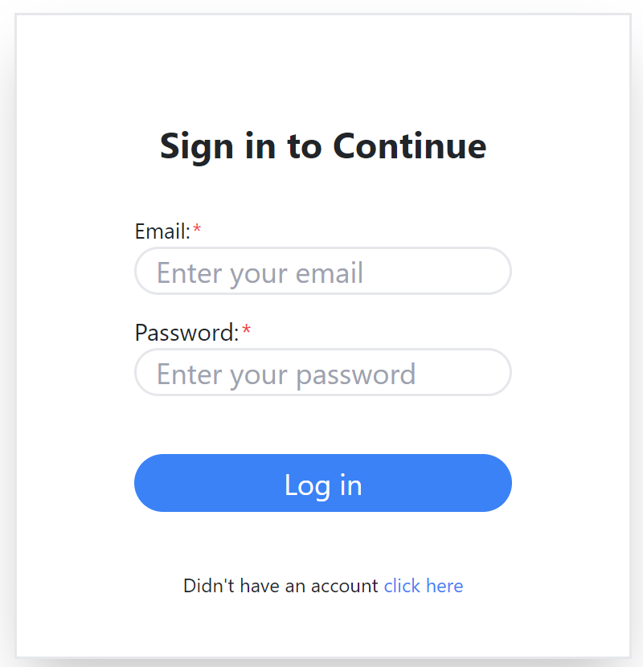
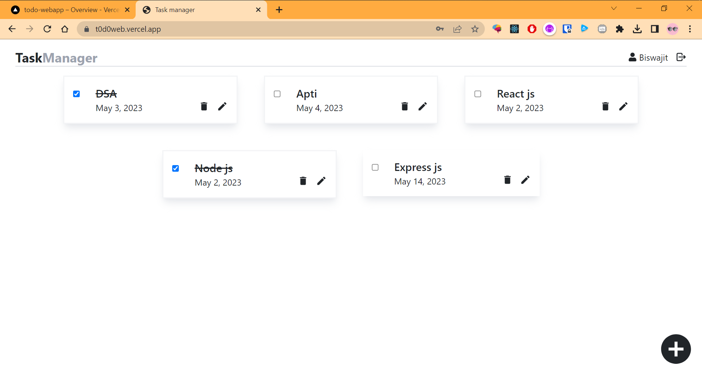

# Todo App 📑

Stay on top of your tasks with our user-friendly Todo app, designed to keep you organized and hassle-free.


## Preview 🗞️





## Live Demo 🧰

[Link](https://t0d0web.vercel.app/)

***

## Tech Stack 💻

**Frontend:** ReactJS, Redux Toolkit, Tailwind CSS emoji
**Backend:** Node js, Express js
**Database** Mongodb atlas

***
# Run Locally

## frontend 📗

Clone the project

```bash
  git clone https://github.com/biswajit035/TODO_WEBAPP.git
```

Go to the project directory

```bash
  cd TODO_WEBAPP
  cd client
```

Install dependencies

```bash
  npm install
```

Start the server

```bash
  npm run start
```


## backend  📘

Clone the project

```bash
  git clone https://github.com/biswajit035/TODO_WEBAPP.git
```

Go to the project directory

```bash
  cd TODO_WEBAPP
```

Install dependencies

```bash
  npm install
```

Start the server

```bash
  npm run dev
```

****


## Environment Variables 📚

To run this project, you will need to add the following environment variables to your .env file
- **at backend**
`DATABASE_ID`= "***************"
`DATABASE_PASS`= "***************"
`JWT_SECRET_KEY`= "***************"

- **at frontend**
`REACT_APP_HOST` = "************"


## Features 🔖

- Login/Signup
- Add Task
- Show Task
- Check/Uncheck Task
- Edit Task
- Delete Task


